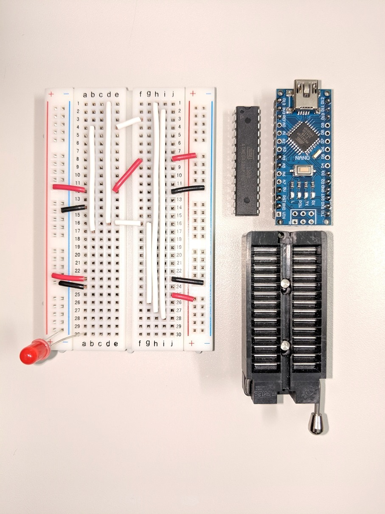

<h1>How to write Arduino sketches to ATMEGA328P with ArduinoNANO compatibles</h1>

<h2>1.enable to avrdude command on the host PC</h2>

on Windows, install <a href="http://winavr.sourceforge.net/" target="_blank">WinAVR</a> and set the path of avrdude command to command prompt

<h2>2.make an Arduino ISP gadget</h2>

 (and need a USB A-miniB cable)
<ol>
         <li>make the gadget</li>
         <li>Install and run <a href="https://www.arduino.cc/en/main/software" target="_blank">Arduino IDE</a></li>
         <li>File >> Examples >> 11.ArduinoISP >> ArduinoISP 
                  </li>
         <li>connect the gadget to the host PC
         <li>set configurations of the gadget (In case the gadget is connected in COM18 USB port) 
                  </li>
         <li>Sketch >> Upload</li>
</ol>

<h2>3.set fuse bytes of the ATMEGA328P</h2>

In case the Arduino ISP gadget is connected in COM18 USB port

<ol>
         <li>check the default setting # avrdude -c arduino -p m328p -P COM18 -b 19200 -v</li>
<pre>
c:\>avrdude -c arduino -p m328p -P COM18 -b 19200 -v

avrdude: Version 5.10, compiled on Jan 19 2010 at 10:45:23
         Copyright (c) 2000-2005 Brian Dean, http://www.bdmicro.com/
         Copyright (c) 2007-2009 Joerg Wunsch

         System wide configuration file is "C:\WinAVR-20100110\bin\avrdude.conf"

         Using Port                    : COM18
         Using Programmer              : arduino
         Overriding Baud Rate          : 19200
         AVR Part                      : ATMEGA328P
         Chip Erase delay              : 9000 us
         PAGEL                         : PD7
         BS2                           : PC2
         RESET disposition             : dedicated
         RETRY pulse                   : SCK
         serial program mode           : yes
         parallel program mode         : yes
         Timeout                       : 200
         StabDelay                     : 100
         CmdexeDelay                   : 25
         SyncLoops                     : 32
         ByteDelay                     : 0
         PollIndex                     : 3
         PollValue                     : 0x53
         Memory Detail                 :

                                  Block Poll               Page      Polled
           Memory Type Mode Delay Size  Indx Paged  Size   Size #Pages MinW  MaxW   ReadBack

           ----------- ---- ----- ----- ---- ------ ------ ---- ------ ----- ----- ---------

           eeprom        65     5     4    0 no       1024    4      0  3600  3600 0xff 0xff
           flash         65     6   128    0 yes     32768  128    256  4500  4500 0xff 0xff
           lfuse          0     0     0    0 no          1    0      0  4500  4500 0x00 0x00
           hfuse          0     0     0    0 no          1    0      0  4500  4500 0x00 0x00
           efuse          0     0     0    0 no          1    0      0  4500  4500 0x00 0x00
           lock           0     0     0    0 no          1    0      0  4500  4500 0x00 0x00
           calibration    0     0     0    0 no          1    0      0     0     0 0x00 0x00
           signature      0     0     0    0 no          3    0      0     0     0 0x00 0x00

         Programmer Type : Arduino
         Description     : Arduino
         Hardware Version: 2
         Firmware Version: 1.18
         Topcard         : Unknown
         Vtarget         : 0.0 V
         Varef           : 0.0 V
         Oscillator      : Off
         SCK period      : 0.1 us

avrdude: AVR device initialized and ready to accept instructions

Reading | ################################################## | 100% 0.01s

avrdude: Device signature = 0x1e950f
avrdude: safemode: lfuse reads as 62
avrdude: safemode: hfuse reads as D9
avrdude: safemode: efuse reads as 7

avrdude: safemode: lfuse reads as 62
avrdude: safemode: hfuse reads as D9
avrdude: safemode: efuse reads as 7
avrdude: safemode: Fuses OK

avrdude done.  Thank you.
</pre>

<li>set fuse bytes 
         # avrdude -c arduino -p m328p -P COM18 -b 19200 -U lfuse:w:0xe2:m -U hfuse:w:0xd9:m -U efuse:w:0x7:m</li>
<pre>
c:\>avrdude -c arduino -p m328p -P COM18 -b 19200 -U lfuse:w:0xe2:m -U hfuse:w:0xd9:m -U efuse:w:0x7:m

avrdude: AVR device initialized and ready to accept instructions

Reading | ################################################## | 100% 0.01s

avrdude: Device signature = 0x1e950f
avrdude: reading input file "0xe2"
avrdude: writing lfuse (1 bytes):

Writing | ################################################## | 100% 0.03s

avrdude: 1 bytes of lfuse written
avrdude: verifying lfuse memory against 0xe2:
avrdude: load data lfuse data from input file 0xe2:
avrdude: input file 0xe2 contains 1 bytes
avrdude: reading on-chip lfuse data:

Reading | ################################################## | 100% 0.01s

avrdude: verifying ...
avrdude: 1 bytes of lfuse verified

avrdude: safemode: Fuses OK

avrdude done.  Thank you.
</pre>
</ol>

<h2>4.write a bootloader to the ATMEGA328P</h2>

Tool >> Burn Bootloader

<h2>5.write an Arduino sketch to the ATMEGA328P</h2>

Sketch >> Upload Using Programmer

